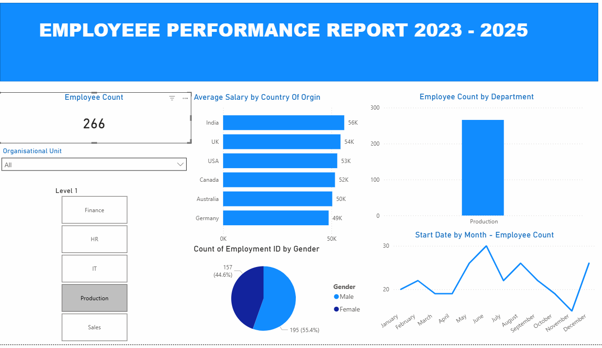

# DATA ANALYTICS PORTFOLIO
## Project 1

**Title:** [HR Performance Analysis Dashboard](https://github.com/EbereUlasi/EbereUlasi.github.io/raw/refs/heads/main/HR_PBI.pbix)

**Tools Used:** Microsoft Excel()

**Project Description:**

**Key findings:**

**Dashboard Overview:**

## Project 2 
**Title:** Pizza sales

**SQL Code:** [Pizza sales ddl and dml](https://github.com/EbereUlasi/EbereUlasi.github.io/blob/main/pizzasales.sql)

**SQL Skills Used:** 

Data Retrieval (SELECT): Queried and extracted specific information from the database.

Data Aggregation (SUM, COUNT): Calculated totals, such as sales and quantities, and counted records to analyze data trends.

Data Filtering (WHERE, BETWEEN, IN, AND): Applied filters to select relevant data, including filtering by ranges and lists.

Data Source Specification (FROM): Specified the tables used as data sources for retrieval

**Project Description:**

**Technology used:** SQL serve

## Project 3

**Title:** [HR Performance Analysis Dashboard](https://github.com/EbereUlasi/EbereUlasi.github.io/raw/refs/heads/main/HR_PBI.pbix)

**Tools Used:** Microsoft Excel()

**Project Description:**

**Key findings:**

**Dashboard Overview:**

